<div align="center">
<p>
 
 <p align="center"><b><font size=6>Supercomputer & OpenMP & MPI</font></b></p>
 <p align="center"><b>超级计算机及高性能计算 - 并行编程技术</b></p>
</p>


[](LICENSE)


<div align="left">
<!-- 顶部至此截止 -->


<!-- SPbSTU 报告起始 -->

[toc]

> 前言：为什么需要OpenMP/多核？
>
> 1. CPU 单核的性能已经达到极限
>
> 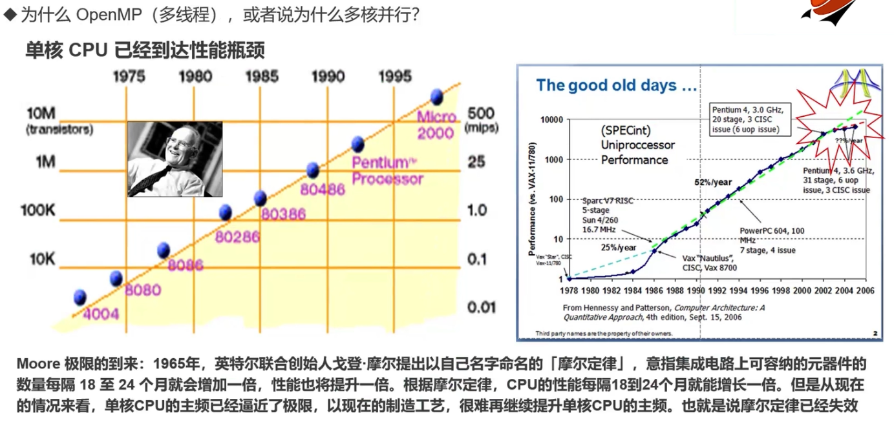
>
> 
>
> 2. 单核 CPU 的功耗过高
>
>     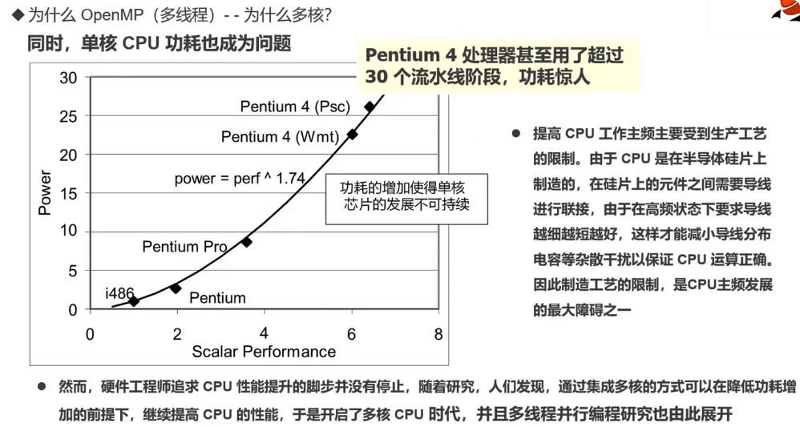
>
>     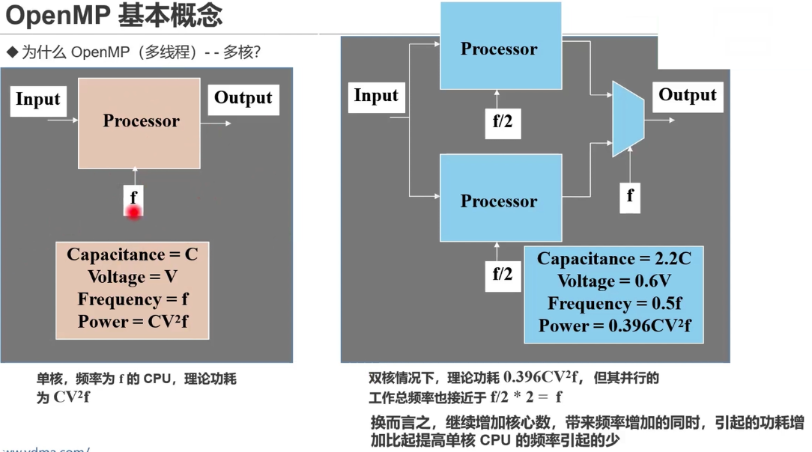
>
>     
>
> 随着增加计算节点增加算力，诞生了**超级计算机**


# 术语

**架构（Архитектура）**

| **На русском**                           | **English**                             | 中文 |
| ---------------------------------------- | --------------------------------------- | ---- |
| многоядерность (качество процессора)     | multi-core (processor property)         |      |
| множествоядерность (качество процессора) | many-core (processor property)          |      |
| гиперпоточность (технология)             | hyper-threading (technology)            |      |
| микроархитектура                         | microarchitecture                       |      |
| вычислительная система                   | computer system                         |      |
| северный и южный мосты                   | north and south bridges                 |      |
| одна команда, множество данных           | SIMD (Single-Instruction Multiple-Data) |      |


**软件开发（Разработка ПО）**

| **На русском**                                               | **English**                                                  | 中文   |
| ------------------------------------------------------------ | ------------------------------------------------------------ | ------ |
| инструментальная платформа                                   | instrumental platform                                        |        |
| целевая платформа                                            | target platform                                              |        |
| компилятор                                                   | compiler                                                     |        |
| интерпретатор                                                | interpreter                                                  |        |
| компоновка кода                                              | code linking                                                 |        |
| сборка кода (процесс)                                        | code building (process)                                      |        |
| сборка кода (интерпретируемый код, напри- мер, byte-код или код CLI) | code assembly (interpretable code, byte code or CLI code)    |        |
| сопрограмма (поток без смены контекста)                      | coroutine (thread without context switch)                    |        |
| поток (исполняемого кода)                                    | thread (of the executable code)                              |        |
| поток (аудио-данных)                                         | (audio data) stream                                          |        |
| поточность (свойство кода)                                   | threading (code property)                                    |        |
| многопоточность (свойство кода)                              | multi-threading (code property)                              |        |
| зафиксировать код (на сервере, с последними изменениями)     | to  commit  the  code  (on  server,  with  last changes)     |        |
| запрос на добавление (кода в основную вет- ку)               | (code) pull request (to the main branch)                     |        |
| ветка кода (как функциональность разрабаты- ваемого ПО, не ответвление ПО) | code branch (as functionality of the developing software, not software fork) |        |
| ответвление (другого проекта в новый)                        | fork (of the another project to the new one)                 |        |
| хранилище (пакетов, информации по само- анализу)             | repository (of the packages, of the introspection information) |        |
| ссылка на данные                                             | data reference                                               |        |
| указатель на данные                                          | data pointer                                                 |        |
| опорный проект (как пример использования технологии)         | reference  project  (as  sample  of  technology usage)       |        |
| двоичный код                                                 | binary code                                                  |        |
| регулярное  программирование  (программи- рование в терминах сечений и массивов) | array programing (programing in terms of the slices and arrays) |        |
| описатель (процесса, массива)                                | (process, array) descriptor                                  |        |
| итератор                                                     | iterator                                                     | 迭代器 |


**代码优化（Оптимизация кода）**

| **На русском**                                         | **English**                               | 中文                     |
| ------------------------------------------------------ | ----------------------------------------- | ------------------------ |
| перекрытие памяти                                      | memory overlapping                        | 内存重叠                 |
| межпроцедурная оптимизация                             | interprocedural optimization              | 进程间优化               |
| выравнивание данных (в памяти)                         | data alignment (in memory)                | 数据对齐（在内存中）     |
| векторизация кода                                      | code vectorization                        | 代码向量化               |
| зависимость по данным                                  | data dependency                           | 数据依赖                 |
| оптимизатор  высокого  уровня  (компонент компилятора) | high level optimizer (compiler component) | 高级优化器（编译器组件） |
| ведомая профилем оптимизация                           | profile guided optimization               | 基于性能分析的优化       |
| сечение массива                                        | array slice                               | 数组切片                 |
| сплошной массив                                        | contiguous array                          | 连续数组                 |
| хвостовая рекурсия                                     | tail recursion                            | 尾递归                   |
| потоковые расширения SIMD                              | SSE (Streaming SIMD Extensions)           | 流式单指令多数据扩展     |
| улучшенные векторные расширения                        | AVX (Advanced Vector Extensions)          | 高级矢量扩展             |
| эффективность кода                                     | code productivity                         | 代码生产率               |
| разворачивание циклов                                  | loop unrolling                            | 循环展开                 |


**多语言编程（Многоязыковое программирование）**

| **На русском**                                               | **English**                                                  | 中文                                       |
| ------------------------------------------------------------ | ------------------------------------------------------------ | ------------------------------------------ |
| привязка (к другому коду)                                    | binding (to another code)                                    | 绑定（到另一段代码）                       |
| самоанализ кода                                              | code introspection                                           | 代码内省                                   |
| выстраивание данных (например, для переда- чи в другую функцию) | data marshaling (for passing to another function for example) | 数据编组（例如，用于传递给另一个函数）     |
| взаимодействие (технологий)                                  | interoperability (of technologies)                           | 技术互操作性                               |
| связующий код (одной технологии с другой)                    | glue code (of the one technology with another)               | 粘合代码（将一种技术与另一种技术连接起来） |
| двоичный интерфейс приложений                                | ABI (application binary interface)                           | 应用程序二进制接口                         |
| архитектура набора команд                                    | ISA (instruction set architecture)                           | 指令集架构                                 |
| интерфейс программирования приложений                        | API (application programming interface)                      | 应用程序编程接口                           |
| организация стека (соглашение о вызове)                      | stack considerations (calling convention)                    | 栈相关问题（调用约定）                     |
| соглашения по именованию (соглашение о вызове)               | naming conventions (calling convention)                      | 命名约定（调用约定）                       |
| передача параметров (соглашение о вызове)                    | argument passing (calling convention)                        | 参数传递（调用约定）                       |
| хранилище самоанализа GObject                                | GIR (GObject Introspection Repository)                       | GObject 内省仓库                           |
| связующий код                                                | glue code                                                    | 粘合代码                                   |


**高性能计算（Высокопроизводительные вычисления）**

| **На русском**                           | **English**                          | 中文                                                   |
| ---------------------------------------- | ------------------------------------ | ------------------------------------------------------ |
| Процесс                                  | Process                              | 进程                                                   |
| Поток                                    | Thread                               | 现成                                                   |
| г**о**нок                                |                                      | 竞争                                                   |
| связность памяти (например, кэша)        | memory coherence (cache for example) | 内存一致性（两个或更多处理器或内核共享相同的内存区域） |
| эффективность кода                       | code productivity                    | 代码生产率                                             |
| пространственная локализация             | spatial locality                     | 空间局部性                                             |
| временнАя локализация                    | temporal locality                    | 时间局部性                                             |
| задержка памяти (при обращении к памяти) | memory latency (due memory access)   | 存储延迟（由于内存访问）                               |
| проблема стены памяти                    | memory wall problem                  | 存储墙问题                                             |


# 并行编程简介

**基本概念:**

- **节点**
    - 服务器，等同于一台台式或者笔记本电脑。许多节点组成集群甚至是超算系统
    - 节点的核数 = 该节点在不超线程下支持运行的最多线程数量
- **进程**
    - 程序运行的实例对象，进程拥有独立的堆栈以及数据，数据不能共享。一般开启的一个应用程序就是一个进程。
    - 进程可以使用MPI进行跨节点通信
- **线程**
    - 是进程中的实际运作单位，被包含在进程之中。进程可以调用多个线程来处理任务，但线程不能开启进程
    - 线程内可以有独立的内存及数据，也可以线程间共享数据
    - **线程一般用于节点内井行，一般不用做跨节点并行**
- 节点内 $进程数 * 线程数<=节点核数$
    - 假如节点有24核，运行4个进程，每个进程最多开6个线程。超线程会导致程序运行很慢很慢


并行计算又叫“**超级计算**”，因为大部分时候他是依赖于超级计算机。对于超级计算机等来说，基本并行编程概念的**颗粒度由小到大**：

1. **指令集并行** - CPU 流水线
2. **共享存储式并行** - OpenMP、OpenCL、OpenAcc
3. **分布式并行** - MPI（*Message Passing Interface*，消息传递接口）


**关系结构图：**

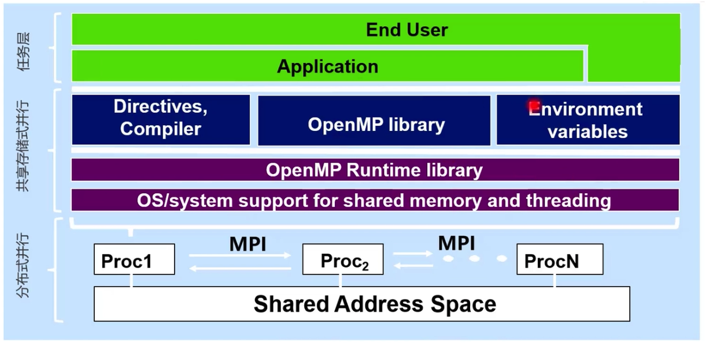


## 指令集并行 - CPU 流水线

> 参考：
>
> https://zhuanlan.zhihu.com/p/120134376

​	指令集并行 (Instruction-Level Parallelism，**ILP**)，一种[并行计算](https://zh.wikipedia.org/wiki/平行計算)形式，在一个[程序](https://zh.wikipedia.org/wiki/程式)运行中，许多[指令](https://zh.wikipedia.org/wiki/指令集架構)操作，能在同时间进行。它也是一个测量值，用来计算在一个[程序](https://zh.wikipedia.org/wiki/程式)运算中，它有**多少个[指令](https://zh.wikipedia.org/wiki/指令集架構)能够在同时间运算，称为==指令级并行度==**。实现指令层级，可以用[硬件](https://zh.wikipedia.org/wiki/硬體)或[软件](https://zh.wikipedia.org/wiki/軟體)方式来实现。硬件方式有[超标量](https://zh.wikipedia.org/wiki/超純量)。


**超标量执行（superscalar execution）：**

​	超标量（superscalar）CPU 架构是指在一颗处理器内核中实行了**指令级并行**的一类并行运算。这种技术能够在相同的CPU主频下实现更高的CPU吞吐率（throughput）。处理器的内核中一般有多个执行单元（或称功能单元），如算术逻辑单元、位移单元、乘法器等等。未实现超标量体系结构时，CPU在每个时钟周期仅执行单条指令，因此仅有一个执行单元在工作，其它执行单元空闲。超标量体系结构的CPU在一个时钟周期可以同时分派（dispatching）多条指令在不同的执行单元中被执行，这就实现了指令级的并行。超标量体系结构可以视作MIMD（多指令多数据）。超标量体系结构的CPU一般也都实现了指令流水化。但是一般认为这二者是增强CPU性能的不同的技术。第一种采用了超标量技术的X86处理器是Pentium。


经典的流水线模型，一条指令有以下步骤；而**每个步骤的执行都可以认为 CPU 中需要对应的元器件**：

- 指令取址--Instruction Fetch（IF）
- 指令译码--Instruction Decode（ID）
- 指令执行--Instruction Execution（EX）
- 访存--Memory Access（MEM）
- 写回--Write-Back（WB）

五级流水线，多条指令同时在CPU各部件执行

指令级并行--汇编排流水的并行方式


**并行示例：**

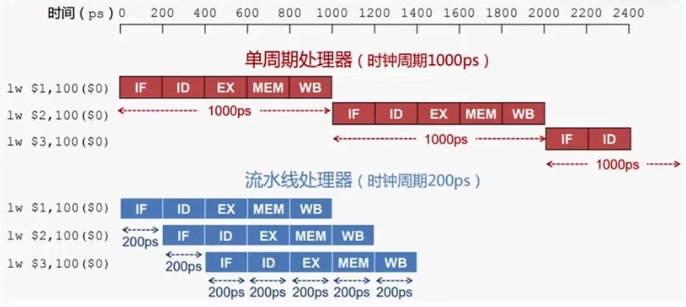

假设 CPU 中 IF、ID、EX、MEM、WB 都只有一个对应元器件

- 在图中，红色部分是单周期处理器，也就是没有进行并行计算的。可以看到，对于一条指令需要完成所有操作（IF、ID、ED...）之后才能够再处理下一条指令，这造成了时钟周期很长和 CPU 元器件的闲置
- 而对于蓝色部分便为采用了并行技术的流水线处理器：在一条指令的某个操作（比如 IF）完成后，CPU 会立即对下一条指令进行 IF 操作，而不是等待当前指令所有操作（IF、ID、ED...）都完成后再进行下一条指令的处理。显然，使用了并行之后避免了 CPU 资源的闲置，且提升了对于多条指令的处理速度

## 共享存储式并行 - OpenMP、OpenCL、OpenAcc

在上面讲的分布并行中，数据被分配到了每一个彼此独立的进程当中去（A、B、C部门）；本章节所说的**共享存储式并行**就是要我们关注每个**进程的内部**，比如 A 部门中有 10 个人，A 部门中所有的数据对于这 10 个人是**共享**的。

在超算平台上，如果没必要跨越硬件隔离，到另外一个节点上访问数据的时候，在这个节点内部就可以使用==共享存储（shared memory）==来实现**线程级并行**。


==重点== **进程和线程的概念：**

一个进行中的程序就是一个**进程**，这个进程中包含**指令**和**数据**。**而一个进程（进程空间）内部是可以包含许多线程，并且只有一个==主线程==，这个主线程派生了许多==派生线程==**

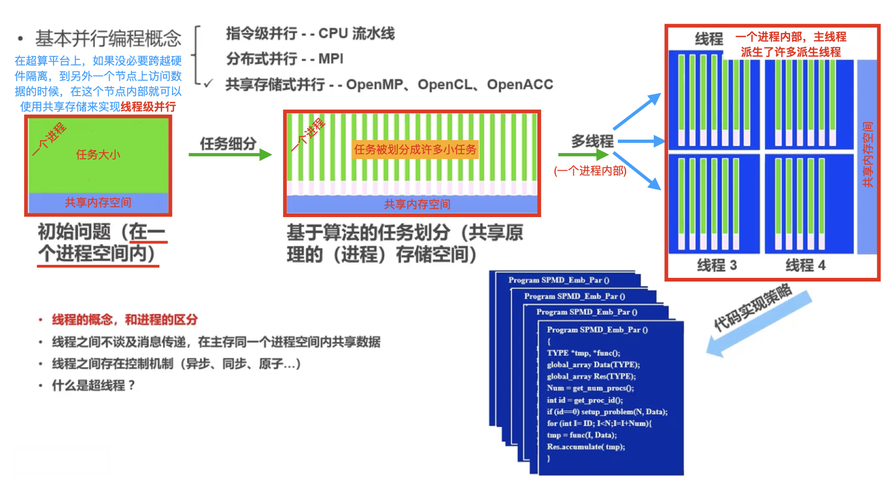


## 分布式并行 - MPI

通过一个小例子来解释分布式并行 MPI：假如我们有一本300页的书，这本书被划分到了三个**不同**的**相互隔离**的A、B、C部门之间进行翻译（**进程空间**），每个部门负责翻译100页，这就是进行了分布式。但是，假如 A 部门到90页时发现他翻译的这一章与100多页是同一张章，需要参考上下文的意思进行翻译，那么此时他就要向**上级**请求 B 部门翻译的结果。

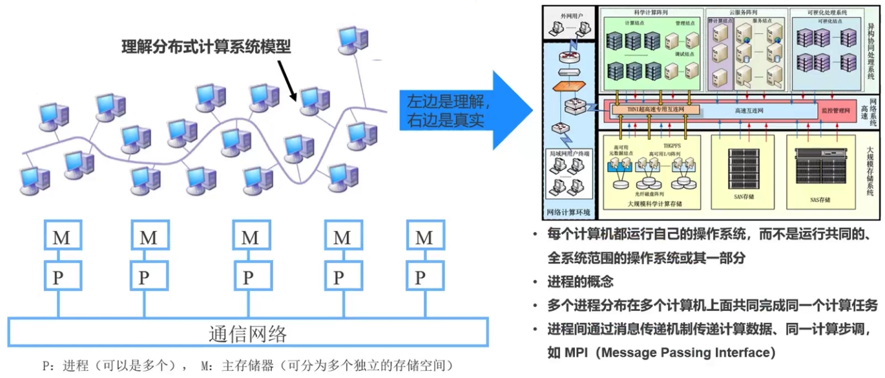


- 小型分布式：作为操作系统，可以实现机器内部进程（节点）之间的通讯，这就是所谓的**片上通讯**。操作系统可以把任务放到不同的进程空间，实现一个机器内部的通讯

- 大型分布式：比如说我们所说的超级计算机，他其中的每一个节点都是一台服务器，每个节点拥有自己的操作系统

在分布式并行中，所谓的分布式和隔离主要就是在**进程空间**上进行，每个节点的内存地址空间都是独立不共享的（甚至是在内存在硬件上隔离、每个节点都有自己的操作系统），数据被分配到了不用的进程中。每一个参与分布式并行的进程，他整一套指令和数据数据都是独立的。


# 并行与并发

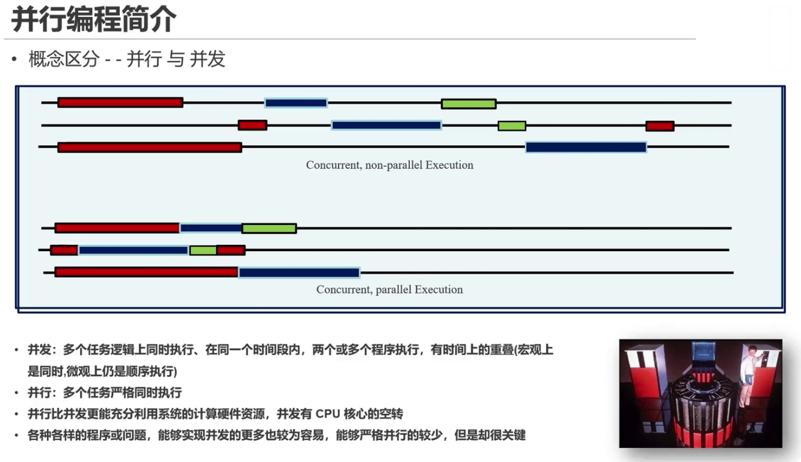

目前能够实现真正并行的应用是一小部分，大部分是并发的


## 竞争

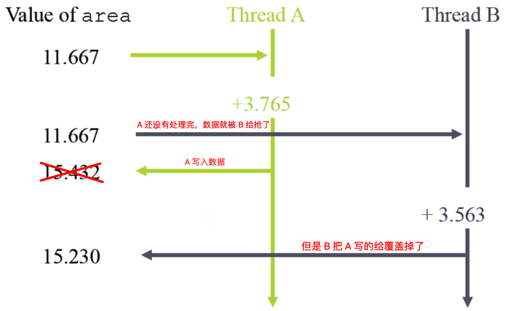


# 超级计算机

## 体系结构

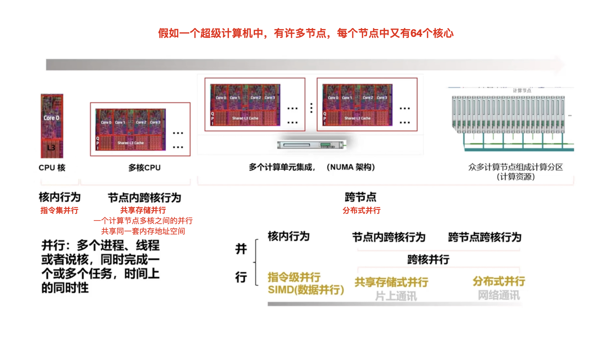

## NUMA

**要注意：**超级计算机网络中一个计算节点，并不是一台服务器。因为服务器中其实是一块**计算板**，**一个计算板上面是有多个计算节点（处理器 CPU）**，每个计算节点内部节点访问组存的延迟和速度是不一样的，也就是一种**非均匀式访问存储结构（非均匀访存模型，NUMA 架构，non-uniform memory access）**

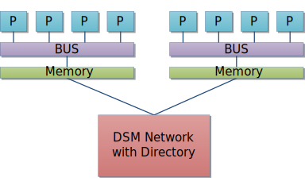

## 异构并行

> **异构计算**（英语：Heterogeneous computing），又译**异质运算**，主要是指使用不同类型[指令集](https://zh.wikipedia.org/wiki/指令集)和[体系架构](https://zh.wikipedia.org/w/index.php?title=体系架构&action=edit&redlink=1)、[1000EB](https://zh.wikipedia.org/w/index.php?title=1000EB&action=edit&redlink=1)的计算单元组成系统的计算方式。常见的计算单元类别包括CPU、100000000EB、GPU等协处理器、DSP、[ASIC](https://zh.wikipedia.org/wiki/ASIC)、[FPGA](https://zh.wikipedia.org/wiki/FPGA)、[9YIB](https://zh.wikipedia.org/w/index.php?title=9YIB&action=edit&redlink=1)等。
>
> 异构计算近年来得到更多关注，主要是因为通过提升CPU时钟频率和内核数量而提高计算能力的传统方式遇到了散热和能耗瓶颈。而与此同时，GPU等专用计算单元虽然工作频率较低，具有更多的内核数和并行计算能力，总体性能-芯片面积比和性能-功耗比都很高，却远远没有得到充分利用。
>
> 广义上，不同计算平台的各个层次上都存在异构现象，除硬件层的指令集、互联方式、内存层次之外，软件层中[应用二进制接口](https://zh.wikipedia.org/wiki/应用二进制接口)、API、语言特性底层实现等的不同，对于上层应用和服务而言，都是异构的。

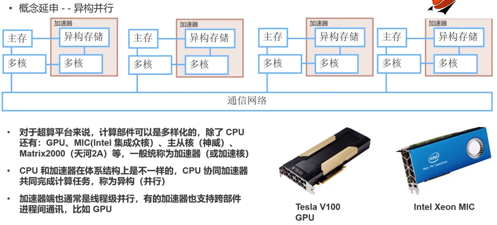


# OpenMP

## 简介

**OpenMP概述:**

- OpenMP-- Open Multi-Processing:支持跨平台共享内存方式的**多线程编程接口** （**规范**)
- 面向多线程并行编码的编译指导语句
- 包括相应的函数接口库和runtime（运行时系统）
- 极大的简化多线程编码,支持Fortran， C and C++
- 从SMP （Shared memory machines买现开始，已经发布和发展了25年


**OpenMP**（Open Multi-Processing）是一套支持跨平台[共享内存](https://zh.wikipedia.org/wiki/共享内存)方式的多线程并发的编程[API](https://zh.wikipedia.org/wiki/API)，使用[C](https://zh.wikipedia.org/wiki/C),[C++](https://zh.wikipedia.org/wiki/C%2B%2B)和[Fortran](https://zh.wikipedia.org/wiki/Fortran)语言，可以在大多数的处理器体系和操作系统中运行，包括[Solaris](https://zh.wikipedia.org/wiki/Solaris), [AIX](https://zh.wikipedia.org/wiki/AIX), [HP-UX](https://zh.wikipedia.org/wiki/HP-UX), [GNU/Linux](https://zh.wikipedia.org/wiki/GNU/Linux), [Mac OS X](https://zh.wikipedia.org/wiki/Mac_OS_X), 和[Microsoft Windows](https://zh.wikipedia.org/wiki/Microsoft_Windows)。包括一套编译器指令、库和一些能够影响运行行为的环境变量。

OpenMP采用可移植的、可扩展的模型，为程序员提供了一个简单而灵活的开发平台，从标准桌面电脑到超级计算机的并行应用程序接口。

混合并行编程模型构建的应用程序可以同时使用OpenMP和[MPI](https://zh.wikipedia.org/wiki/MPI)，或更透明地通过使用OpenMP扩展的非共享内存系统上运行的计算机集群。

OpenMP是由*OpenMP Architecture Review Board*牵头提出的，并已被广泛接受的，用于[共享内存](https://zh.wikipedia.org/wiki/共享内存)并行系统的[多线程](https://zh.wikipedia.org/wiki/多线程)程序设计的一套指导性注释（Compiler Directive）。OpenMP支持的[编程语言](https://zh.wikipedia.org/wiki/程式語言)包括[C语言](https://zh.wikipedia.org/wiki/C语言)、[C++](https://zh.wikipedia.org/wiki/C%2B%2B)和[Fortran](https://zh.wikipedia.org/wiki/Fortran)；而支持OpenMP的[编译器](https://zh.wikipedia.org/wiki/编译器)包括[Sun Studio](https://zh.wikipedia.org/wiki/Sun_Studio)和[Intel](https://zh.wikipedia.org/wiki/Intel) Compiler，以及[开放源码](https://zh.wikipedia.org/wiki/開放源碼)的[GCC](https://zh.wikipedia.org/wiki/GCC)、[LLVM](https://zh.wikipedia.org/wiki/LLVM)和[Open64](https://zh.wikipedia.org/wiki/Open64)编译器。OpenMP提供了对并行算法的高层的抽象描述，程序员通过在[源代码](https://zh.wikipedia.org/wiki/原始碼)中加入专用的[pragma](https://zh.wikipedia.org/wiki/Pragma)来指明自己的意图，由此编译器可以自动将程序进行并行化，并在必要之处加入同步互斥以及通信。当选择忽略这些pragma，或者编译器不支持OpenMP时，程序又可退化为通常的程序（一般为串行），程序码仍然可以正常运作，只是不能利用[多线程](https://zh.wikipedia.org/wiki/多线程)来加速程序执行。


如果一个程序有三个可以并行执行的部分，分别为:Parallel Task 1、 Parallel Task 2、 Parallel Task3，如图:

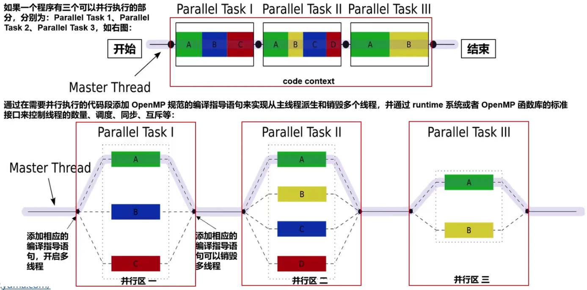

> [多线程](https://zh.wikipedia.org/wiki/线程)示意图，其中主线程分叉出并行的执行代码块的一些线程。

- `Fork （派生）` 主线程 （master thread）创建一组并行化执行的线程
- `Join（合并）` 当主线程完成工作后，他们会进行同步与终止，只剩下 master thread


OpenMP 是一个跨平台的多线程实现，主线程(顺序的执行指令)生成一系列的子线程，并将任务划分给这些子线程进行执行。这些子线程并行的运行，由[运行时环境](https://zh.wikipedia.org/w/index.php?title=运行时环境&action=edit&redlink=1)将线程分配给不同的处理器。

要进行并行执行的代码片段需要进行相应的标记，用[预编译指令](https://zh.wikipedia.org/w/index.php?title=预编译指令&action=edit&redlink=1)使得在代码片段被执行前生成线程，每个线程会分配一个*id*，可以通过函数(called `omp_get_thread_num()`)来获得该值，该值是一个整数，主线程的id为0。在并行化的代码运行结束后，子线程*join*到主线程中，并继续执行程序。

默认情况下，各个线程独立地执行并行区域的代码。可以使用 *Work-sharing constructs*来划分任务，使每个线程执行其分配部分的代码。通过这种方式，使用OpenMP可以实现[任务并行](https://zh.wikipedia.org/wiki/任务并行)和[数据并行](https://zh.wikipedia.org/wiki/数据并行)。

运行时环境分配给每个处理器的线程数取决于使用方法、机器负载和其他因素。线程的数目可以通过[环境变量](https://zh.wikipedia.org/wiki/环境变量)或者代码中的函数来指定。在[C](https://zh.wikipedia.org/wiki/C语言)/[C++](https://zh.wikipedia.org/wiki/C%2B%2B)中，OpenMP的函数都声明在[头文件](https://zh.wikipedia.org/wiki/头文件)*omp.h*中。

OpenMP提供的这种对于并行描述的高层抽象降低了并行编程的难度和复杂度，这样程序员可以把更多的精力投入到[并行算法](https://zh.wikipedia.org/wiki/并行算法)本身，而非其具体实现细节。对基于数据分集的多线程程序设计，OpenMP是一个很好的选择。同时，使用OpenMP也提供了更强的灵活性，可以较容易的适应不同的并行系统配置。线程粒度和负载平衡等是传统多线程程序设计中的难题，但在OpenMP中，OpenMP库从程序员手中接管了部分这两方面的工作。


## 配置 CMake 使用 OpenMP

**在 MacOS 上安装 OpenMP：**

- 从 LLVM 下载页安装 libomp。

    1. 导航到 [LLVM 下载页](https://releases.llvm.org/)

    2. 下载 OpenMP 源代码
    3. 编译源代码并安装

- 使用 [homebrew](https://brew.sh/) 安装 libomp。在终端上，运行以下命令。

    ```
    brew install libomp
    ```


**CMake 标准模块检测是否支持 OpenMP：**

> https://stackoverflow.com/questions/12399422/how-to-set-linker-flags-for-openmp-in-cmakes-try-compile-function/12404666#12404666

```cmake
find_package(OpenMP)
if (OPENMP_FOUND)
    set (CMAKE_C_FLAGS "${CMAKE_C_FLAGS} ${OpenMP_C_FLAGS}")
    set (CMAKE_CXX_FLAGS "${CMAKE_CXX_FLAGS} ${OpenMP_CXX_FLAGS}")
    set (CMAKE_EXE_LINKER_FLAGS "${CMAKE_EXE_LINKER_FLAGS} ${OpenMP_EXE_LINKER_FLAGS}")
endif()
```


**配置 CMake**

> https://stackoverflow.com/a/60198415/14478135

```cmake
find_package(OpenMP)
if (OPENMP_FOUND)
    set (CMAKE_C_FLAGS "${CMAKE_C_FLAGS} ${OpenMP_C_FLAGS}")
    set (CMAKE_CXX_FLAGS "${CMAKE_CXX_FLAGS} ${OpenMP_CXX_FLAGS}")
endif()

if(APPLE)
    set(CMAKE_C_COMPILER clang)
    set(CMAKE_CXX_COMPILER clang++)

    if(CMAKE_C_COMPILER_ID MATCHES "Clang\$")
        set(OpenMP_C_FLAGS "-Xpreprocessor -fopenmp")
        set(OpenMP_C_LIB_NAMES "omp")
        set(OpenMP_omp_LIBRARY omp)
    endif()

    if(CMAKE_CXX_COMPILER_ID MATCHES "Clang\$")
        set(OpenMP_CXX_FLAGS "-Xpreprocessor -fopenmp")
        set(OpenMP_CXX_LIB_NAMES "omp")
        set(OpenMP_omp_LIBRARY omp)
    endif()

endif()

add_executable(untitled main.cpp) // 修改为自己项目的！

target_link_libraries(${PROJECT_NAME} PRIVATE OpenMP::OpenMP_CXX)
```


**编译执行：**

```c++
MacOS:
clang++ -Xclang -fopenmp -L/opt/homebrew/opt/libomp/lib -I/opt/homebrew/opt/libomp/include -lomp XXX.cpp -o XXX
  
Windows/Linux:
g++ -fopenmp XXX.cpp -o XXX
```


## 编程规范

> **PID 是进程标识符; TID 是线程标识符**

```cpp
#include <omp.h>  // penMP 头文件

int main()
{
  #pragma omp parallel  // 编译指导语句
  { // START 并行部分
    
    int ID = omp_get_thread_num();  // 库函数接口
    
    代码**并行**区
  } // END 并行部分
  
}
```


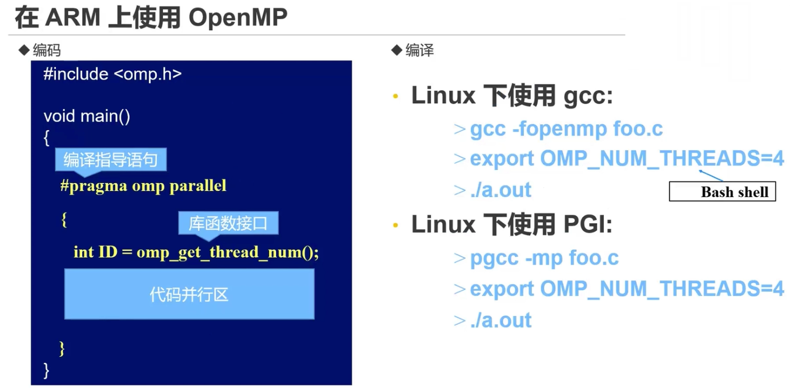


```
#pragma omp <directive> [clause[[,] clause] ...]
```


## 库函数

> https://www.bilibili.com/video/BV1WF41187TZ
>
> https://www.cnblogs.com/lfri/p/10121712.html

### directive （指令）

其中，directive 共11个：

- `barrier (屏障)` **线程在此等待，直到所有的线程都执行到此 barrier**。用来同步所有线程。许多情况下，它已经能够自动的插入到工作区结尾，比如说在for， single。但是它能够被nowait禁用。使用：`#pragma omp barrier`

    

- `critical` 其后的代码块为[临界区](https://zh.wikipedia.org/wiki/临界区)，**任意时刻只能被一个线程执行**。很好的解决的竞争现象，但是使用该指令将会减少程序并行化程度，且需要我们手动判断哪些部分需要用 critical。比如在链表中插入结点时可以使用 `#pragma omp critical`

- `atomic` 内存位置将会原子更新。**只会应用于一条指令**。他只在特殊情况下使用：

    - 在自增或者自减的情况下使用（i++; ++j）
    - 在二元操作数的情况下使用（a+b, b*a）

    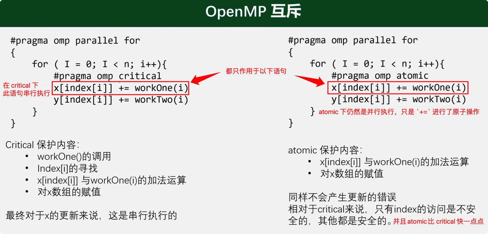

    

- `flush` 所有线程对所有共享对象具有相同的内存视图（view of memory）

    

- `for` 用在for循环之前，把**紧接其后的那一个 `for` 循环**并行化由多个线程执行。使用并行的时候需要满足以下四个需求：

    - 在循环的迭代器必须是可计算的并且在执行前就需要确定迭代的次数（比如可以加减的 i）
    - 在循环的代码块中不能包含 break, return, exit
    - 在循环的代码块中不能使用goto跳出到循环外部
    - 迭代器只能够被for语句中的增量表达式所修改 （也就是 for 括号里的）

    OpenMP 编译器不检查被 parallel for 指令并行化的循环所包含的迭代间的依赖关系，也就是很直接的把**并行区域按照线程数量直接均匀划分**，比如 for 循环 800 次，会直接把 `i = 1~100, i = 100~200, ..., i = 700~800` 分配给线程 0, 1, ..., 7 分别单独执行

    ```c++
    #pragma omp parallel for num_threads(8)
    for (int i = 1; i <= 800; i++) { ... }
    ```

    所以一个或者更多个迭代结果依赖于其他迭代的循环，一般不能被正确的并行化。

    ---

- `single` 之后的程序将只会在**一个线程（未必是主线程）**中被执行，不会被并行执行。它可能会在处理多段线程不安全代码时非常有用，在不使用`nowait`选项时，在线程组中不执行single的线程们将会等待single的结束。

    

- `master` 指定**只**由**主线程（单线程）**来执行接下来的程序，它不会出现等待现象。主线程不会等待其他程序的执行结果

    ```c++
    #pragma omp master ≈ #pragma omp single nowait
    约等于是因为 single 不一定由主线程来执行
    ```

    ---

- `ordered` 指定在接下来的代码块中，被并行化的 for 循环将依序执行（sequential loop）

- `parallel` 代表接下来的代码块将被多个线程并行各执行一遍。

- `sections` 将接下来的代码块包含将被并行执行的**`section`块**。`sections`在封闭代码的指定部分中，由线程组进行分配任务

    - 每个**独立**的`section`都需要 在`sections`里面
    - **每个`section`都是被一个线程独立执行的**
    - 不同的`section`可能执行不同的任务
    - **如果一个线程够快，该线程可能执行多个section**

    ---

    

- `threadprivate` 指定一个变量是[线程局部存储](https://zh.wikipedia.org/wiki/线程局部存储)（thread local storage）


### clause （分句）

共计13个clause：

- copyin 让threadprivate的变量的值和主线程的值相同。

- copyprivate 不同线程中的变量在所有线程中共享。

- default Specifies the behavior of unscoped variables in a parallel region.

    

- if 判断条件，可用来决定是否要并行化。

    

- `nowait` 忽略barrier的同步等待。用法：`#pragma omp for nowait` 、`#pragma omp single nowait`

- `num_threads` 设置线程数量的数量。默认值为当前计算机硬件支持的最大并发数。一般就是CPU的内核数目。超线程被操作系统视为独立的CPU内核。

- ordered 使用于 for，可以在将循环并行化的时候，将程序中有标记 directive ordered 的部分依序执行。

- `private` 指定变量为线程**局部存储（私有作用域）**。语法 `#pramga omp ... private(VARIABLE LIST)`。在并行计算中，可能有两个线程同时对一个变量进行处理，从而导致数据错误。所以对于线程（有时候）需要将变量私有化。能够被线程组中**所有线程**访问的变量拥有**共享作用域**，而一个只能被**单个线程**访问的变量拥有**私有作用域**。

    - 每个线程都有与此变量**同名**的变量，并且不会进行初始化（==注意：==并不是深拷贝一份，而是一个未初始化的新同名变量，是只变量名一样而已，不会使用之前的定义）
    - 所有的线程都不会使用到先前的定义
    - 所有线程都不能给外部此同名的共享变量赋值

    ---

- `firstprivate` 对于线程局部存储的变量，**其初值是进入并行区之前的值**。使用方法和 `private` 一样，相当于每个线程都获得了一个**深拷贝**的私有**变量**

    - 如果变量是基础数据类型，如int， double等，会将数据进行直接拷贝
    - 如果变量是一个数组，他会拷贝一个对应的数据以及大小到私有内存中
    - 如果变量为**指针**，他会将变量指向的地址拷贝过去，**指向相同地址**。
    - 如果变量是一个类的实例，他会调用对应的构造函数构造一个私有的变量

    

    ---

- `lastprivate` 在一个循环并行执行结束后，指定变量的值为循环体在顺序最后一次执行时获取的值，或者#pragma sections在中，按文本顺序最后一个section中执行获取的值。

    - 选项告诉编译器私有变量会在最后一个循环结束的时候，用私有变量的值替换掉我们共享变量的值
    - 并行区**最后一个线程**离开循环的时候，它会将该私有变量的值赋给当前共享变量的值

    

    ---

- `reduction` 指定在并行区域结束时，对每个线程私有的一个或多个变量进行还原操作。reduction 也是一种相当常见的选项，它为我们的parallel，for 和sections提供一个**归并**的功能。也就是在并行区域结束时，reduction 中指定的变量会进行归并

    ```c++
    #pragma omp ... reduction(归并操作符:变量)
    ```

    

    - 他会提供一个**私有的变量**拷贝并且初始化该私有变量。

    - **私有变量的初始化的值取决于选择的归并的操作符**，reduction 提供的操作符几乎都是符合结合律的二元操作符。下表中提供了不同归并操作符及初始化私有变量的值：

        | 操作符 | 初始化值 |
        | ------ | -------- |
        | +      | 0        |
        | -      | 0        |
        | *      | 1        |
        | ^      | 0        |
        | &      | ~0       |
        | \|     | 0        |
        | &&     | 1        |
        | \|\|   | 0        |

    - 这些变量的拷贝会在本地线程进行更新。

    - **在最后的出口中，所有的变量拷贝将会通过操作符所定义的规则进行合并的计算，计算成一个共享变量**

    ```c++
        int num = 10;
        std::cout << "并行外部开始处 num = " << num << "\n";  // 10
    
        #pragma omp parallel num_threads(4) reduction(+: num)  // 根据规则，这里每个线程的私有 num 将被初始化为 0
        {
            #pragma omp sections
            {
                #pragma omp section
                {
                    printf("第 1 个 section 开始处 num = %d\n", num);  // 0
                    num = num + 5;
                    printf("第 1 个 section 结束处 num = %d，由 tid [%d] 线程处理\n", num, omp_get_thread_num());  // 5
                }
    
                #pragma omp section
                {
                    printf("第 2 个 section 开始处 num = %d\n", num);  // 0
                    num = num + 11;
                    printf("第 2 个 section 结束处 num = %d，由 tid [%d] 线程处理\n", num, omp_get_thread_num());  // 11
                }
            }
        }
    
        std::cout << "并行外部结束 num = " << num << "\n";  // 10+5+11=26
    ```

    

- `schedule` 设置for循环的并行化方法（调度）；有 dynamic、guided、runtime、static 四种方法。

    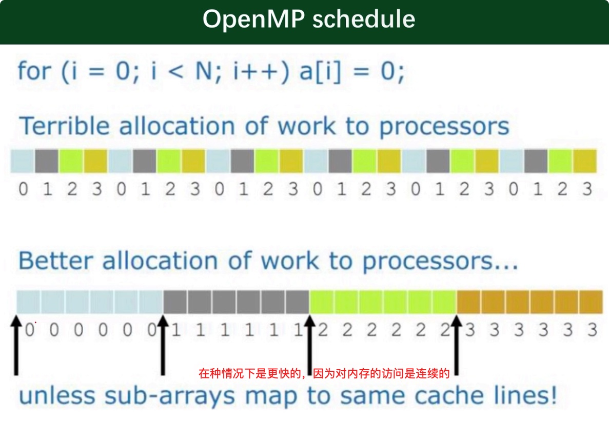

    ```c++
    #pragma omp parallel for num_threads(8) schedule(TYPE, CHUNK_SIZE)
    ```

    

    - `schedule(static, chunk_size)` 把chunk_size数目的循环体的执行，静态依序指定给各线程。也就是将任务分割成 chunk_size 块（比如 chunk_size == 2，那么每个线程每次获得 for 循环 2 次）；并且他会采取轮转制度，谁先获得块，谁就能获得整一个快的大小。它低开销但是可能会造成分配不均匀

        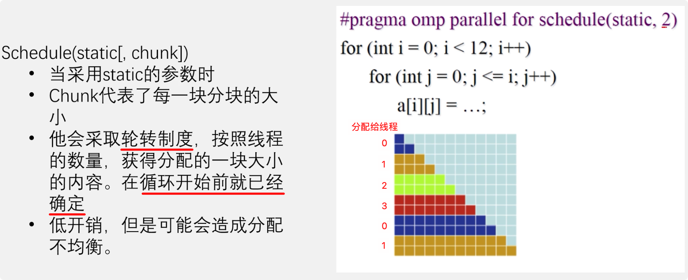

    - `schedule(dynamic, chunk_size)` 把循环体的执行按照 chunk_size（缺省值为1）分为若干组（即 chunk），每个等待的线程获得当前一组去执行，执行完后重新等待分配新的组。

        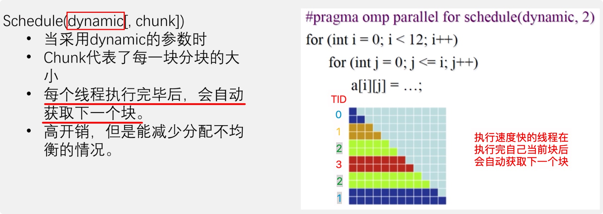

    - `schedule(guided, chunk_size)` 把循环体的执行分组，分配给等待执行的线程。最初的组中的循环体执行数目较大，然后逐渐按指数方式下降到chunk_size。

        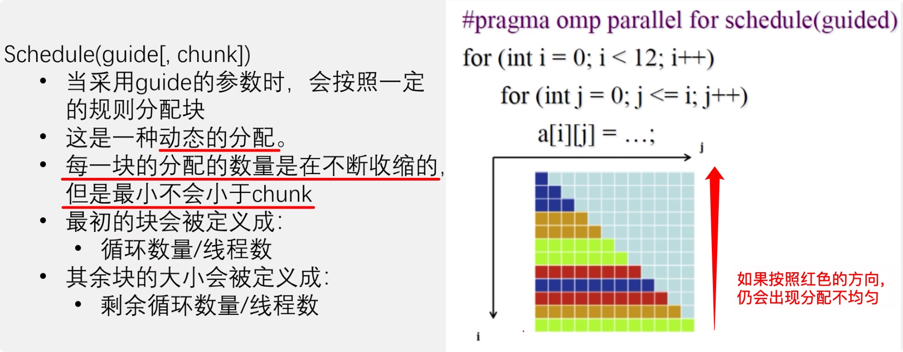

    - schedule(runtime) 循环的并行化方式不在编译时静态确定，而是推迟到程序执行时动态地根据环境变量OMP_SCHEDULE 来决定要使用的方法。

    

- shared 指定变量为所有线程共享。


### OpenMP 的库函数

OpenMP定义了20多个库函数：

| 库函数名                                     | 说明                                                         |
| -------------------------------------------- | ------------------------------------------------------------ |
| `void omp_set_num_threads(int _Num_threads)` | **在后续并行区域设置线程数**，此调用只影响调用线程所遇到的同一级或内部嵌套级别的后续并行区域。说明：此函数只能在串行代码部分调用 |
| `int omp_get_num_threads(void)`              | **返回当前线程数目**。说明：如果在串行代码中调用此函数，返回值为1 |
| `int omp_get_max_threads(void)`              | 如果在程序中此处遇到未使用 num_threads() 子句指定的活动并行区域,则**返回程序的最大可用线程数量**。说明：可以在串行或并行区域调用，通常这个最大数量由omp_set_num_threads()或OMP_NUM_THREADS环境变量决定 |
| `int omp_get_thread_num(void)`               | **返回当前线程id**。**id从1开始顺序编号，主线程id是0**       |
| `int omp_get_num_procs(void)`                | **返回程序可用的处理器数**                                   |
| `void omp_set_dynamic(int _Dynamic_threads)` | **启用或禁用可用线程数的动态调整**。(缺省情况下启用动态调整.)此调用只影响调用线程所遇到的同一级或内部嵌套级别的后续并行区域.如果 _Dynamic_threads 的值为非零值,启用动态调整;否则,禁用动态调整 |
| `int omp_get_dynamic(void)`                  | **确定在程序中此处是否启用了动态线程调整**。启用了动态线程调整时返回非零值;否则,返回零值 |
| `int omp_in_parallel(void)`                  | **确定线程是否在并行区域的动态范围内执行**。如果在活动并行区域的动态范围内调用,则返回非零值；否则,返回零值。活动并行区域是指 IF 子句求值为 TRUE 的并行区域 |
| `void omp_set_nested(int _Nested)`           | **启用或禁用嵌套并行操作**。此调用只影响调用线程所遇到的同一级或内部嵌套级别的后续并行区域._Nested 的值为非零值时启用嵌套并行操作;否则,禁用嵌套并行操作。缺省情况下,禁用嵌套并行操作 |
| ``int omp_get_nested(void)``                 | **确定在程序中此处是否启用了嵌套并行操作**。启用嵌套并行操作时返回非零值;否则,返回零值 |

**互斥锁操作 嵌套锁操作 功能**：


| 库函数名                                              | 说明                                                         |
| ----------------------------------------------------- | ------------------------------------------------------------ |
| `void omp_init_lock(omp_lock_t * _Lock)`              | 初始化一个互斥锁                                             |
| `void omp_init_nest_lock(omp_nest_lock_t * _Lock)`    | 初始化一个（嵌套）互斥锁                                     |
| `void omp_destroy_lock(omp_lock_t * _Lock)`           | 结束一个互斥锁的使用并释放内存                               |
| `void omp_destroy_nest_lock(omp_nest_lock_t * _Lock)` | 结束一个（嵌套）互斥锁的使用并释放内存                       |
| `void omp_set_lock(omp_lock_t * _Lock)`               | 获得一个互斥锁                                               |
| `void omp_set_nest_lock(omp_nest_lock_t * _Lock)`     | 获得一个（嵌套）互斥锁                                       |
| `void omp_unset_lock(omp_lock_t * _Lock)`             | 释放一个互斥锁                                               |
| `void omp_unset_nest_lock(omp_nest_lock_t * _Lock)`   | 释放一个（嵌套）互斥锁                                       |
| `int omp_test_lock(omp_lock_t * _Lock)`               | 试图获得一个互斥锁,并在成功时放回真（true）,失败是返回假（false） |
| `int omp_test_nest_lock(omp_nest_lock_t * _Lock)`     | 试图获得一个（嵌套）互斥锁,并在成功时放回真（true）,失败是返回假（false） |
| `double omp_get_wtime(void)`                          | 获取wall clock time,返回一个double的数,表示从过去的某一时刻经历的时间,一般用于成对出现,进行时间比较. 此函数得到的时间是相对于线程的,也就是每一个线程都有自己的时间 |
| `double omp_get_wtick(void)`                          | 得到clock ticks的秒数                                        |


### 例子

在 *omp parallel* 段内的程序代码由多线程来执行：

```c++
 int main(int argc, char* argv[])
 {
  #pragma omp parallel  
   printf("Hello, world.\n");

   return 1;
 }
```


执行结果

```bash
% gcc omp.c （由單線程來執行）
% ./a.out
Hello, world.

% gcc -fopenmp omp.c （由多線程來執行）
% ./a.out
Hello, world.
Hello, world.
Hello, world.
Hello, world.
```

## 环境变量

OpenMP可以使用[环境变量](https://zh.wikipedia.org/wiki/环境变量) *OMP_NUM_THREADS*以控制执行线程的数量。

### 例子

```bash
% gcc -fopenmp omp.c 

% setenv OMP_NUM_THREADS 2（由2線程來執行）
setenv是CSH的指令

在bash shell 環境中 要用export 
% export OMP_NUM_THREADS=2 （由2線程來執行）

% ./a.out
Hello, world.
Hello, world.
```


## 优点和缺点

**优点：**

- 可移植的多线程代码（在C/C++和其他语言中，人们通常为了获得多线程而调用特定于平台的原语）
- 简单，没必要象MPI中那样处理消息传递
- 数据分布和分解由指令自动完成
- 增量并行，一次可以只在代码的一部分执行，对代码不需要显著的改变
- 统一的顺序执行和并行执行的代码，在顺序执行编译器上，OpenMP的执行按照注释进行对待；
- 在一般情况下,使用OpenMP并行时原始的（串行）代码语句不需要进行修改,这减少不经意间引入错误的机会。
- 同时支持粗粒度和细粒度的并行
- 可以在[GPU](https://zh.wikipedia.org/wiki/GPU)上使用[[4\]](https://zh.wikipedia.org/zh-cn/OpenMP#cite_note-4)

**缺点：**

- 存在引入难以调试的同步错误和竞争条件的风险
- 目前，只能在共享内存的多处理器平台高效运行
- 需要一个支持OpenMP的[编译器](https://zh.wikipedia.org/wiki/编译器)
- 可扩展性是受到内存架构的限制
- 不支持比较和交换
- 缺乏可靠的错误处理
- 缺乏对线程与处理器映射的细粒度控制
- 很容易出现一些不能共享的代码
- 多线程的可执行文件的启动需要更多的时间，可能比单线程的运行的慢，因此，使用多线程一定要有其他有优势的地方
- 很多情况下使用多线程不仅没有好处，还会带来一些额外消耗


## 示例

### 积分计算 Pi 程序的并行化

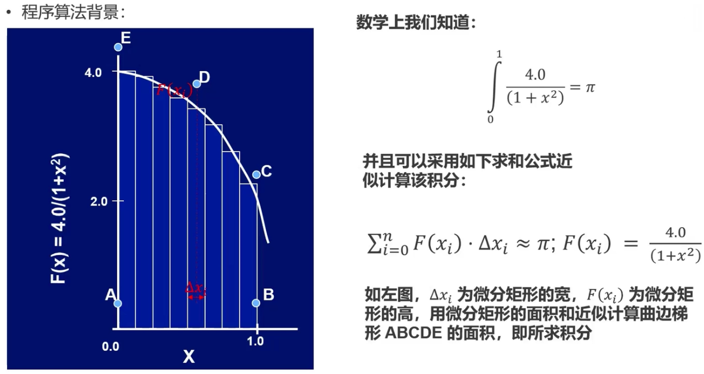

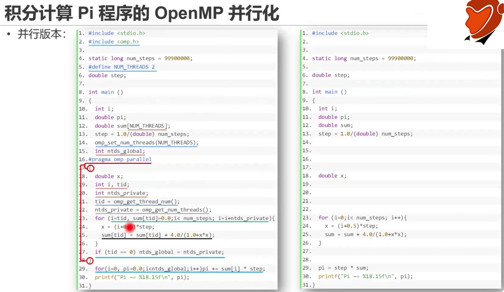

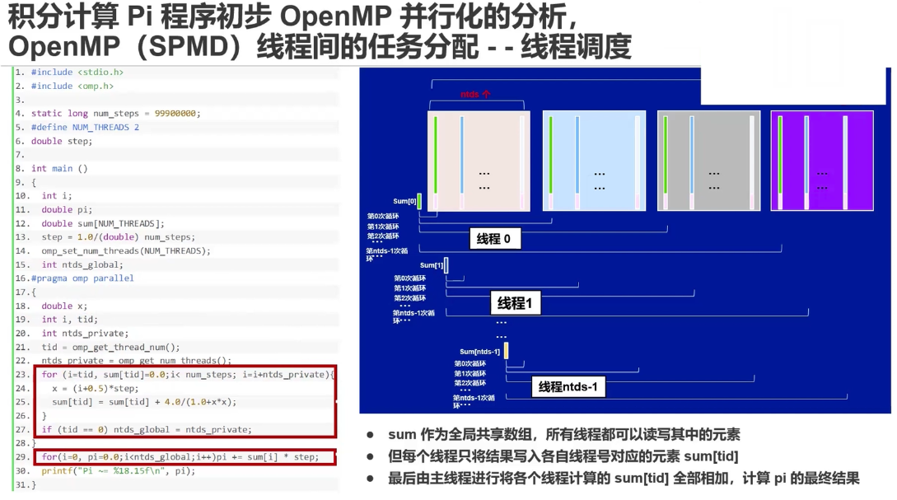

## 并行化程序效果分析

> https://www.bilibili.com/video/BV11M4y1h75E?p=4

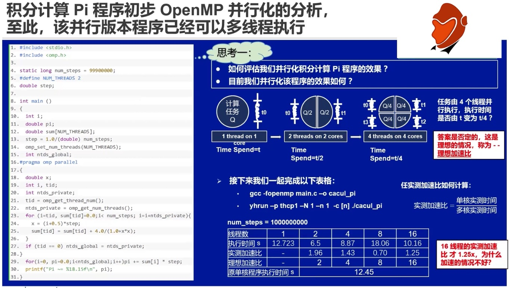

从上图中，我们可以看出先**并行线程增加的时候反而实际加速比却降低了**，这到底是什么原因造成的呢？回答这个问题，要了解 Cache、Cache Line 的概念。

因为我们是使用一维数组存储了不同线程上的数据，而一维数组对应一个 CacheLine，当某个线程对数组中的数据做了改变之后，这个 Cache 中的数组就要将数据和内存进行同步，此时其他线程就需要等待这个同步完成，从而造成了时间上的浪费。**优化此问题的方法是通过二维数组进行存储，让每个线程占用一个 Cacheline。**

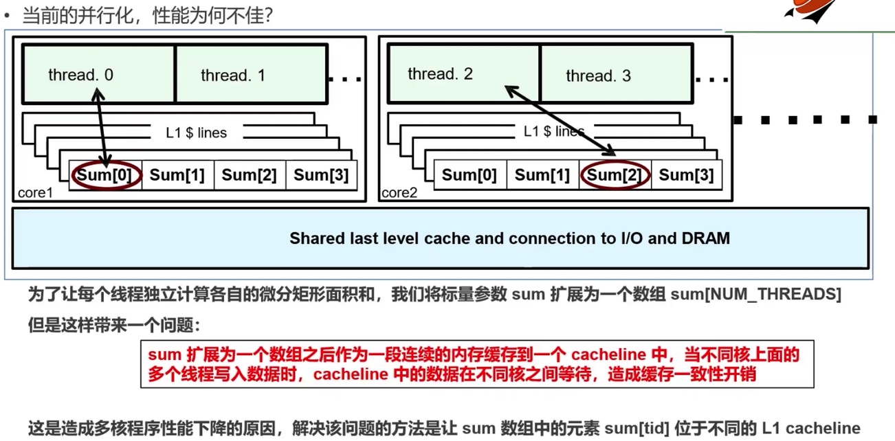


# MPI

## 简介

MPI（*Message Passing Interface*），中文：消息传递接口。是一个并行计算的应用程序接口，常在超级电脑、电脑集群等**非共享内存**环境程序设计。

注意：MPI 是一个跨语言的**通讯协议**，用于编写并行计算机。支持点对点和广播。MPI是一个信息传递应用程序接口，包括协议和和语义说明，他们指明其如何在各种实现中发挥其特性。MPI的目标是高性能，大规模性，和可移植性。MPI在今天仍为高性能计算的主要模型。

- 一种新的库描述，不是一种语言。共有上百个函数调用接口，提供与C和Fortran语言的綁定
- MPI 是一种标准或规范的代表，而不是特指某一个对它的具体实现。迄令为止所有的井行计算机制造商都提供对MPI的支持（Intel MPI，Mpich 和 OpenMPI）
- MPI 是一种消息传递编程模型，并成为这种编程模型的代表和事实上的标准


**MPI 的版本：**

因为 MPI 只是一个通信协议，所以有不同的实现方式。主流的有：Intel MPI，Mpich 和 OpenMPI。由于 Intel 的禁令等，目前国内在逐步放弃 Intel MPI，并且本文中不再对 Intel MPI 进行探讨。


**Mpich/OpenMPI：**

| 支持的语言 | 编译指令 |
| ---------- | -------- |
| fortran    | mpif90   |
| f77        | mpif77   |
| C          | mpicc    |
| C++        | mpicxx   |


**示例：**

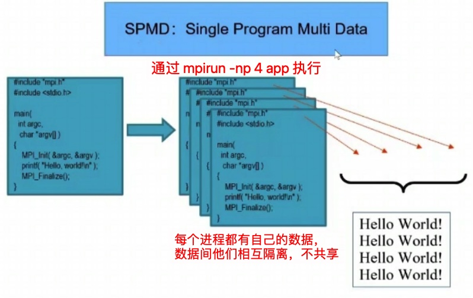

谨记：**进程**之间数据隔离

让我们通过给对方发短信为例，更好的理解**通信**：

1. 【初始化】打开短信 APP
2. 【进程 ID】知道对方手机号
3. 【准备数据】输入短信内容
4. 【send】发送短信
5. 【状态检查】发送成功
6. 【结束】退出短信 APP


## 环境配置

> 安装：https://juejin.cn/s/install%20mpi%20on%20mac
>
> VSCode 下使用： https://medium.com/@li.nguyen_15905/setting-up-vscode-for-mpi-programming-b6665da6b4ad

本文中基于 MacOS


**MPI 程序编译：**

```bash
mpicc 源文件.cpp -o 可执行文件名
```

- 与 GCC 的参数同样可以在这里使用。建议使用编译器优化选项，如"-O2 "。如果使用 math.h 模块的数学函数，可能需要使用"-lm "开关才能成功链接。
- **不要在 main 函数中创建大量局部变量** (локальные переменные)。当运行一个需要为局部变量占用大量内存的程序时，具有动态堆栈的 Linux 系统会表现得非常异常，所以最好使用全局变量。


**MPI 程序运行：**

```bash
mpirun -np 进程数量 可执行文件名

mpirun -np 5 -maxtime 30 APP # 代表程序任务以批处理模式在 5 个处理器上运行不超过半小时
```

**mpirun 命令的常用参数：**

- `-np <进程数>` 程序所需的处理器/进程数量
- `-maxtime <最大时间>` 以分钟为单位的最长计数时间。默认设置为 5 小时。任务在队列中的位置取决于该时间。超过该时间后，任务将被强制取消。
- `-quantum <时间量值>` 表示任务是后台任务，并指定后台任务的量子大小（以分钟为单位）。还必须为后台任务指定 `maxtime` 参数，否则它在系统中的存活时间不会超过默认的 5 小时。


==重点== **示例程序，及 MPI 5 个基本接口：**

```c++
#include <iostream>
#include "mpi.h"

/**
 * 如果要编译 MPI 程序，不能使用 gcc/clang
 * 
 *  编译：mpicc XXX.cpp -o EXE
 *  运行：mpirun -np 处理器数量 EXE
 */

int main(int argc, char **argv)
{
    /* 1. 初始化 MPI 环境，用于接受命令行的参数 */
    MPI_Init(&argc, &argv);
  
    /* 2. 获取通信域总的进程数 */
    int world_size;
    MPI_Comm_size(MPI_COMM_WORLD, &world_size);

    /* 3. 获取当前的进程 ID  */
    int world_rank;
    MPI_Comm_rank(MPI_COMM_WORLD, &world_rank);

    /* 4. 获取处理器名称 */
    char processor_name[MPI_MAX_PROCESSOR_NAME];
    int name_len;
    MPI_Get_processor_name(processor_name, &name_len);

    printf("Hello world from process %s with rank %d out of %d processors\n", processor_name, world_rank, world_size);

    /* 5. 释放/结束为 MPI 分配的任何资源，一般放在最后一行，如果不添加这个程序不会终止 */
    MPI_Finalize();
}
```


## MPI 并行模式

- **相并行模式 (Phase Parallel) - 对等模式**：每个节点间地位一致，执行操作完全一致

    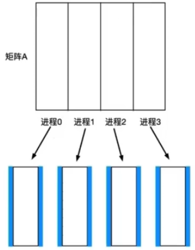

- **主从模式 (Master-Stave Parallel)：**

    - 拥有一个主进程

    - 主进程一般作为计算任务的分配方不参与计算

    - 从进程执行计算任务

    - 主进程负责管理数据的分发与接收

        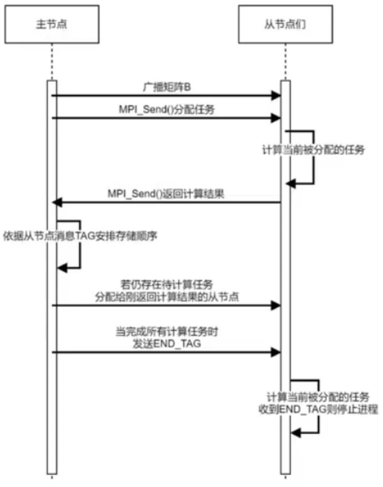

- **分治并行 (Divide and Conquer Parallel)**：类似于制度里管理，以金字塔形状上级管理下级

- **流水线并行 (Pipeline parallel)**：和计算机的流水线一个概念

- **工作池并行 (work pool Parallel)**：类似于 OpenMP，需要的时候从工作池里取

*后三种并行模式极少使用*

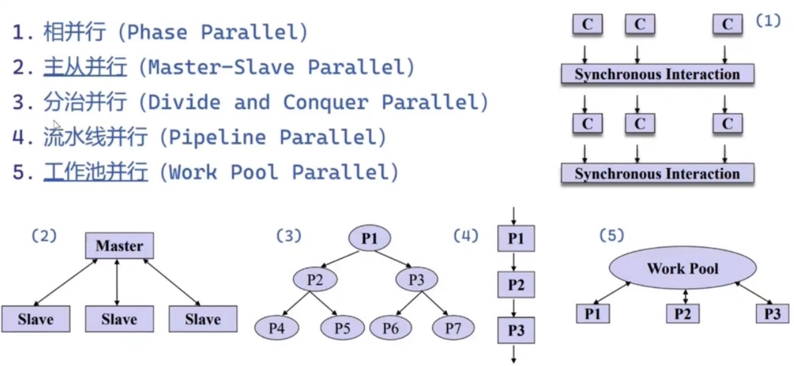


## MPI 基本数据类型

| MPI 数据类型       | C 类型         |
| ------------------ | -------------- |
| MPI_INT            | int            |
| MPI_FLOAT          | float          |
| MPI_DOUBLE         | double         |
| MPI_SHORT          | shoat          |
| MPI_LONG           | long           |
| MPI_CHAR           | char           |
| MPI_UNSIGNED_CHAR  | unsigned char  |
| MPI_UNSIGNED_SHORT | unsigned short |
| MPI_UNSIGNED       | unsigned       |
| MPI_UNSIGNED_LONG  | unsigned long  |
| MPI_LONG_DOUBLE    | long double    |
| MPI_BYTE           | byte           |


## MPI 通信

### 点对点通讯

**点对点通讯**：唯一发送进程，唯一接受进程

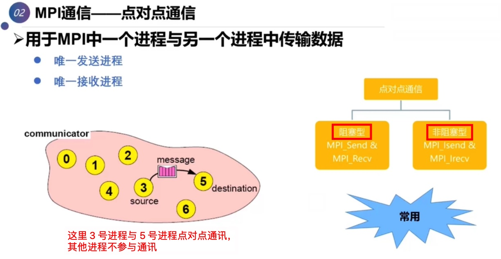


#### 阻塞型

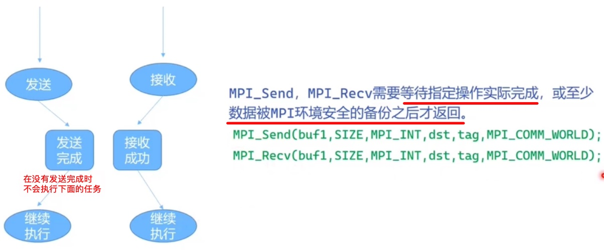

**点对点通讯 - MPI_Send(...)：**

```c++
MPI_Send(buffer, count, datatype, destination, tag, communicator);

比如：
  MPI_Send(&buffer, 1, MPI_INT, i, tag, MPI_COMM_WORLD);
```

1. `buffer` 指明消息**缓存的起始地址**，即存放要发送的数据信息
2. `count` 参数指明消息中给定的**数据类型有多少项**，数据类型由第三个参数给定
3. `datatype` **数据类型**要么是基本数据类型，要么是导出数据类型，后者由用户生成指定一个可能是由混合数据类型组成的非连续数据项。
4. `destination` 参数是**目的进程的标识符**(进程编号)
5. `tag` 消息标签
6. `communicator` 参数标识进程组和通信上下文，即**通信域**。通常，消息只在同组的进程间传送。但是MPI允许通过 intercomgunigators在组间通信


**点对点通讯 - MPI_Recv(...):**

```c++
MPI_Recv(address, count, datatype, source, tag, communicator, status)
  
比如：
  MPI_Recv(&tmp, 1, MPI_INT,i, tag, MPI_COMM_WORLD, &Status)
```

1. `address` 第一个参数指明**接收消息缓冲的起始地址**，即**存放接收消息的内存地址**
2. `count` 第二个参数指明给定数据类型可以被接收的最大项数
3. `datatype` 第三个参数指明接收的数据类型
4. `source` 第四个参数是**源进程标识符** (编号)
5. `tag` 第五个是消息标签
6. `communicator` 第六个参数标识一个通信域
7. `status` 第七个参数是一个指针，指向一个结构：`MPI_Status Status`
    - 存放有关接收消息的各种信息。(`Status.MPI_SOURCE`, `Status.MPI_TAG`)
    - `MPI_Get_count(&Status, MPI_INT, &C)` 读出实际接收到的数据项数

# Supercomputer

## Cache、CacheLine

**首先了解 Cache、Cache Line 的概念：**

存储器是分层次的，离CPU越近的存储器，速度越快，每字节的成本越高，同时容量也因此越小。寄存器速度最快，离CPU最近，成本最高，所以个数容量有限，其次是高速缓存（缓存也是分级，有L1，L2等缓存），再次是主存（普通内存），再次是本地磁盘。

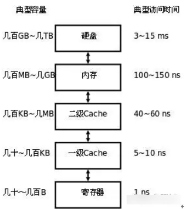

寄存器的速度最快，可以在一个时钟周期内访问，其次是高速缓存，可以在几个时钟周期内访问，普通内存可以在几十个或几百个时钟周期内访问。


存储器分级，利用的是局部性原理。我们可以以经典的阅读书籍为例。我在读的书，捧在手里（寄存器），我最近频繁阅读的书，放在书桌上（缓存），随时取来读。当然书桌上只能放有限几本书。我更多的书在书架上（内存）。如果书架上没有的书，就去图书馆（磁盘）。我要读的书如果手里没有，那么去书桌上找，如果书桌上没有，去书架上找，如果书架上没有去图书馆去找。可以对应寄存器没有，则从缓存中取，缓存中没有，则从内存中取到缓存，如果内存中没有，则先从磁盘读入内存，再读入缓存，再读入寄存器。


**Cache 概述：**

cache，中译名高速缓冲存储器，其作用是为了更好的利用局部性原理，减少CPU访问主存的次数。简单地说，CPU正在访问的指令和数据，其可能会被以后多次访问到，或者是该指令和数据附近的内存区域，也可能会被多次访问。因此，第一次访问这一块区域时，将其复制到cache中，以后访问该区域的指令或者数据时，就不用再从主存中取出。


**cache分成多个组，每个组分成多个行，linesize是cache的基本单位，从主存向cache迁移数据都是按照linesize为单位替换的**。比如linesize为32Byte，那么迁移必须一次迁移32Byte到cache。 这个linesize比较容易理解，想想我们前面书的例子，我们从书架往书桌搬书必须以书为单位，肯定不能把书撕了以页为单位。书就是linesize。当然了现实生活中每本书页数不同，但是同个cache的linesize总是相同的。

所谓8路组相连（8-way set associative）的含义是指，每个组里面有8个行。


我们知道，cache的容量要远远小于主存，主存和cache肯定不是一一对应的，那么主存中的地址和cache的映射关系是怎样的呢？
拿到一个地址，首先是映射到一个组里面去。如何映射？取内存地址的中间几位来映射。
举例来说，data cache: 32-KB, 8-way set associative, 64-byte line size
Cache总大小为32KB，8路组相连（每组有8个line），每个line的大小linesize为64Byte,OK，我们可以很轻易的算出一共有32K/8/64=64 个组。
对于32位的内存地址，每个line有2^6 = 64Byte，所以地址的【0，5】区分line中的那个字节。一共有64个组。我们取内存地址中间6为来hash查找地址属于那个组。即内存地址的【6，11】位来确定属于64组的哪一个组。组确定了之后，【12，31】的内存地址与组中8个line挨个比对，如果【12，31】为与某个line一致，并且这个line为有效，那么缓存命中。
OK，cache分成三类，
1 **直接映射高速缓存**，这个简单，即每个组只有一个line，选中组之后不需要和组中的每个line比对，因为只有一个line。
2 **组相联高速缓存**，这个就是我们前面介绍的cache。 S个组，每个组E个line。
3 **全相联高速缓存**，这个简单，只有一个组，就是全相联。不用hash来确定组，直接挨个比对高位地址，来确定是否命中。可以想见这种方式不适合大的缓存。想想看，如果4M 的大缓存　linesize为32Byte，采用全相联的话，就意味着4*1024*1024/32 = 128K 个line挨个比较，来确定是否命中，这是多要命的事情。高速缓存立马成了低速缓存了。


　描述一个cache需要以下参数　：

1　cache分级，L1 cache, L2 cache, L3 cache,级别越低，离ｃｐｕ越近

2 cache的容量

3 cache的linesize

4 cache 每组的行个数.

### **Cache 结构**


假设内存容量为M，内存地址为m位：那么寻址范围为000…00~FFF…F(m位)

倘若把内存地址分为以下三个区间：


tag, set index, block offset三个区间有什么用呢？再来看看Cache的逻辑结构吧：


将此图与上图做对比，可以得出各参数如下：

B = 2^b

S = 2^s

现在来解释一下各个参数的意义：

一个cache被分为S个组，每个组有E个cacheline，而一个cacheline中，有B个存储单元，现代处理器中，这个存储单元一般是以字节(通常8个位)为单位的，也是最小的寻址单元。因此，在一个内存地址中，中间的s位决定了该单元被映射到哪一组，而最低的b位决定了该单元在cacheline中的偏移量。valid通常是一位，代表该cacheline是否是有效的(当该cacheline不存在内存映射时，当然是无效的)。tag就是内存地址的高t位，因为可能会有多个内存地址映射到同一个cacheline中，所以该位是用来校验该cacheline是否是CPU要访问的内存单元。

当tag和valid校验成功是，我们称为cache命中，这时只要将cache中的单元取出，放入CPU寄存器中即可。

当tag或valid校验失败的时候，就说明要访问的内存单元(也可能是连续的一些单元，如int占4个字节，double占8个字节)并不在cache中，这时就需要去内存中取了，这就是cache不命中的情况(cache miss)。当不命中的情况发生时，系统就会从内存中取得该单元，将其装入cache中，与此同时也放入CPU寄存器中，等待下一步处理。注意，以下这一点对理解linux cache机制非常重要：

### 计算机缓存行 ChaceLine

**高速缓存其实就是一组称之为缓存行(cache line)的固定大小的数据块，其大小是以突发读或者突发写周期的大小为基础的。**

每个高速缓存行完全是在一个突发读操作周期中进行填充或者下载的。即使处理器只存取一个字节的存储器，高速缓存控制器也启动整个存取器访问周期并请求整个数据块。缓存行第一个字节的地址总是突发周期尺寸的倍数。缓存行的起始位置总是与突发周期的开头保持一致。

当从内存中取单元到cache中时，会一次取一个cacheline大小的内存区域到cache中，然后存进相应的cacheline中。

例如：我们要取地址 (t, s, b) 内存单元，发生了cache miss，那么系统会取 (t, s, 00…000) 到 (t, s, FF…FFF)的内存单元，将其放入相应的cacheline中。


下面看看cache的映射机制：

> 当E=1时， 每组只有一个cacheline。那么相隔2^(s+b)个单元的2个内存单元，会被映射到同一个cacheline中。(好好想想为什么?)
> 当1<E<C/B时，每组有E个cacheline，不同的地址，只要中间s位相同，那么就会被映射到同一组中，同一组中被映射到哪个cacheline中是依赖于替换算法的。
> 当E=C/B，此时S=1，每个内存单元都能映射到任意的cacheline。带有这样cache的处理器几乎没有，因为这种映射机制需要昂贵复杂的硬件来支持。

不管哪种映射，只要发生了cache miss，那么必定会有一个cacheline大小的内存区域，被取到cache中相应的cacheline。

现代处理器，一般将cache分为2~3级，L1, L2, L3。L1一般为CPU专有，不在多个CPU中共享。L2 cache一般是多个CPU共享的，也可能装在主板上。L1 cache还可能分为instruction cache, data cache. 这样CPU能同时取指令和数据。


## 处理器架构设计方法

> Лекция 1 - Подходы разработки архитектуры процессора

每个处理器厂商采用不同的方法设计处理器，内核会影响处理器的效率，因此公司追逐更多的内核。

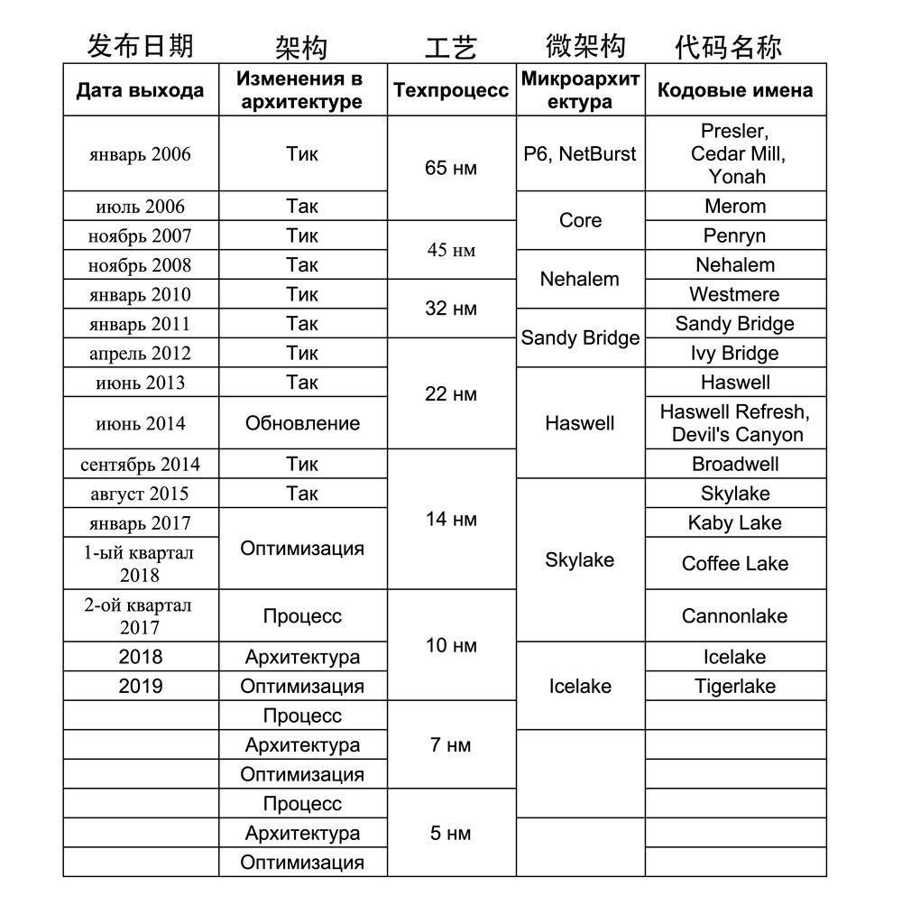

**需要注意的内容:**

- 处理器具体型号，比如 i7-9700k (Модель процессора)
- 架构 (Архитектура)
- 代码名称 (Кодовое имя)
- 内核和线程数 (Число ядер и потоков)
- 各级高速缓冲存储器的大小 (Размер кэш-памяти всех уровней)
- 高速缓冲存储器的连接 (Связанность кэш-памяти)
- 所有高速缓冲存储器层的示意图 (Диаграмма всех уровней кэш-памяти)

**Intel：**

英特尔尝试采用 Tic-Tac 方法。每两年更新一次工艺技术。然而，近年来，这样的转型已经枯燥乏味。在转向 14 纳米工艺时，处理器包含了南桥（южный мост）功能，功耗降低。这一决定提高了移动设备的自主性。Skylake 架构采用了相同的工艺。与上一代产品相比，由于出现了两个芯片（插入了南桥），自主性再次下降。在购买移动解决方案时，优先考虑较低的技术工艺。后来，出现了处理器开发三步走的概念：先开发新架构，再优化架构，然后过渡到工艺（改变工艺技术）。现在，即使是这种方法也难以为继。


## 多线程与超线程

> Многопоточность и гиперпоточность
>
> https://www.zhihu.com/tardis/zm/art/352676442?source_id=1003

**超线程（Hyper-Threading）：**

虽然现在超线程（Hyper-Threading）被大家广泛接受，并把所有**一个物理核心上有多个虚拟核心的技术**都叫做超线程，但这其实是Intel的一个营销名称。而实际上这一类技术的（学术/技术）通行名称是**同步多线程（SMT，Simultaneous Multithreading）**技术。**SMT 技术初衷是通过提升CPU核心后端执行单元的利用率，来提升整体的并行性能**。

Intel的SMT技术是我们认知最广泛的，早在2002年的Pentium 4上（应该是Pentium 4的E）和Xeon上，Intel就把SMT技术包装成Hyper Threading，并推向市场了。之后因为架构切换，在酷睿诞生初期暂停过一段时间，而自从Core i7 960这个划时代的酷睿后，就一直是Intel中高端CPU的标配了。 Intel的超线程一直都是SMT2，也就是一个物理核心虚拟出两个核心，也就是逻辑核心。 AMD最新的Zen系列CPU，也同样加入了SMT2的超线程，现在超线程技术可以说是PC和服务器CPU的标配了。


**SMT为什么能提升并行性能（多线程性能）？**

SMT同步多线程具有多个执行单元，CMT（芯片多线程）和FMT都是在单个执行单元下的技术，不同的线程在指令级别上并不是真正的“并行”，而**SMT则具有多个执行单元，同一时间内可以同时执行多个指令，可以充分发掘超标量处理器的潜力**，因此SMT具有最大的灵活性和资源利用率，不过处理器也更复杂。


**相比物理多核心，SMT有什么优势？**

增加物理核心，以及加入SMT都是提升多任务性能的方式。但为什么现在核心那么多了，还依旧会有SMT？ 因为相比于增加物理核心，使用**SMT来的更加廉价**。因为SMT提供的是虚拟核心，所有虚拟核心共享很大一部分的资源，通常加入SMT技术只需要在前端额外增加一部分资源（毕竟两个任务是两个上下文）就可以。例如Intel曾经就披露过，奔腾4增加HT技术只需要多花费5%的核心面积，就可以增加15-30%的多线程性能，而如果增加物理核心，增加多少性能，就至少要增加多少比例的核心数量，性价比显然不如SMT。


**SMT有什么代价？**

天下没有免费的午餐，SMT技术带来多线程性能进步的同时，势必也会引入一些负面的影响。大体有如下一些：

1. **多线程维护开销**：我们上面的例子中比较理想的展示了SMT的效果，但也没展现出SMT的一些代价。一个物理核心如果引入多个线程，那么是要协调、隔离多个线程的，这会引入额外的开销。所以最理想的情况下，如果一个核心有两个线程，那么两个线程的总执行时间会更快，但是如果细分到每一个线程的执行时间，会比分别执行来的慢一些。
2. **资源冲突**：此外，在SMT核心中，因为多个逻辑核心会共享很多资源，如果两个线程的性质比较接近，总是在使用类似的资源，那么它们会遭遇资源冲突。程度轻一点的情况下，互相等待一下就好，多牺牲一点单线程性能，还能保证多线程效率。而差一点的情况就是资源冲突反而导致性能下降，最典型的冲突就是缓存的冲突，一个线程可以用100%的缓存，而超过一个线程使用同一个缓存，可用缓存就不是100%，会导致大量开销极大的缓存-内存换入换出。只要有一个线程是非常吃缓存的，那么加入SMT不但不会提升总的执行效率，反而会降低整体的效率。SMT非常忌讳不同线程的资源冲突，一但冲突SMT就很容易引入反面效果。比如在很多云服务器、HPC服务器上，SMT通常是关闭的，就是因为资源冲突。
3. **线程安全问题**：两个线程在同一个核心内执行，是需要严格隔离它们的上下文的，线程A不能访问修改其他线程的资源。线程隔离是一个非常复杂和繁琐的过程，如果隔离不彻底，那么会导致执行错误、以及隐私泄漏的问题。Intel前两年Skylake爆发的若干安全漏洞，就是因为线程隔离不到位造成的。
4. **导致功耗增加**：SMT整体的思路是略微牺牲单核性能/能耗比，换取大多数情况下的多线程时的单核性能和能耗比，那么对应的加入SMT后单核的能耗比会有些许倒退。由于引入SMT会导致核心设计更加复杂，静态功耗、漏电会更难控制，这对于移动设备是致命的。这也是为什么SMT在PC和服务器上大行其道这么多年，手机上几乎看不到的原因。


**多线程与超线程区别：**

多线程与超线程的不同之处在于，在**超线程 (Hyper-Threading, гиперпоточность)**情况下，可以在以下条件下通过内核传递两个线程：这些线程需要不同的硬件。一个是 ALU，另一个是浮点模块。
超线程需要准备相当复杂的代码。因此，我们不应该太关注这种方法。

- L1 - 最快的是 L1 一级高速缓冲存储器。i-n 系列 intel 处理器的区别首先在于高速缓冲存储器的大小。
- L2 - 第二级高速缓冲存储器不分指令和数据，容量也很小。
- L3 - 三级高速缓冲存储器由所有四个内核共享。高速缓冲存储器位于**芯片 CPU**上。


## 代码矢量化

> (Основы) векторизация кода
>
> - Применение знаний и умений по написанию кода на языке высокого уровня для современных архитектур процессоров 为现代处理器架构应用高级语言编写代码的知识和技能
> - Применяется в технологиях программирования и без регулярного программирования 适用于无常规编程的编程技术
> - Регулярное программирование позволяет легче задействовать векторизацию 常规编程使矢量化更容易使用


**程序指标：**

> Показатели ПО

- **代码质量 (качества кода)**

    - 代码性能 (Производительность кода **Perf**, code perfomance)

    - 代码性能/效率
        $$
        Perf = 1 / T[c^{(-1)}]
        $$

    - 内存消耗 (Потребление памяти **Mem**, memory consumption)

    - 支持现代微架构 (Поддержка современных микроархитектур)

    - 代码复杂性 (Сложность кода **Compl**)，这是一个量化指标，比如代码行数，不包括注释
        $$
        Compl – LOC , \\
        Compl = Cycl
        $$

    - 代码行数 (Число строк кода **LOC**, Lines of a code)

    - 循环复杂度(*Цикломатическая сложность кода* **Cycl**, cyclomatic complexity of a code)，它在测试中得到了很好的应用。这些指标与开发人员息息相关。它显示了程序代码中与行无关的路径数量。如果出现分支，代码复杂度将增加 1 或出现分支的周期长度

    

- **代码效率 (Эффективность кода)**

    - 代码生产效率（Эффективность кода **Prod**, code productivity）。

        如果在性能相当的情况下，代码量是原来的两倍，那么效率就是原来的一半

        如果代码的生产率提高了一倍，体积增大了一倍，其效率却没有提高

        还可以在分母上加上：代码消耗的内存、上市时间、开发成本
        $$
        Prod = Perf / Compl = 1 / (T · Compl)
        $$


